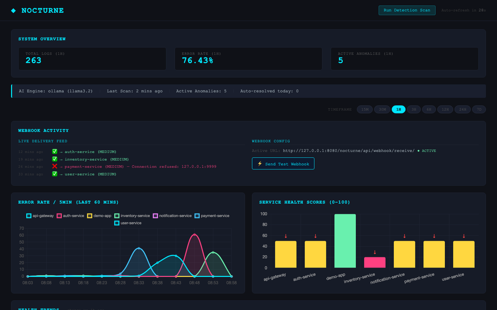
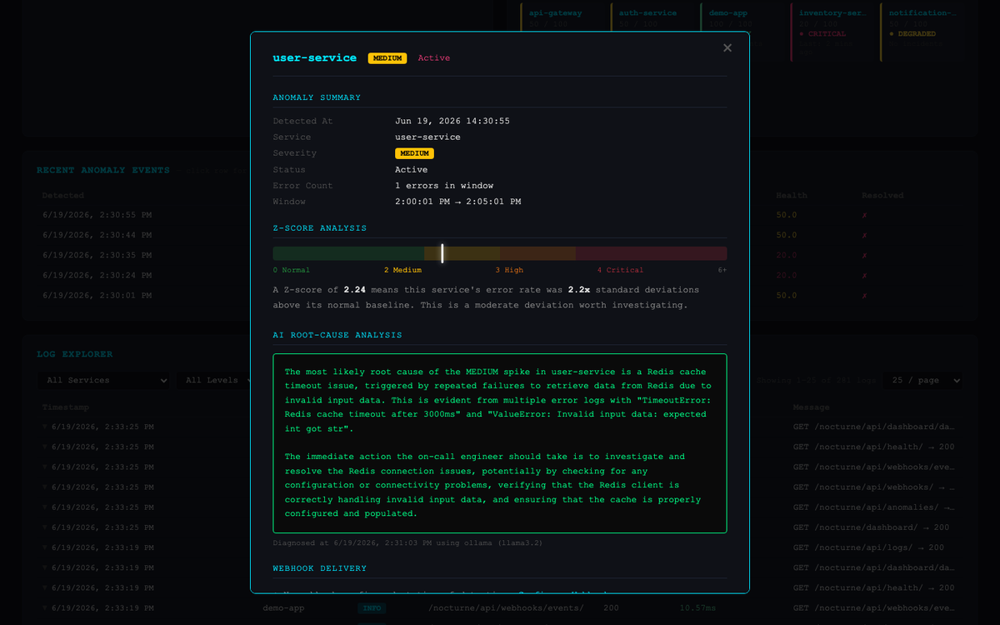
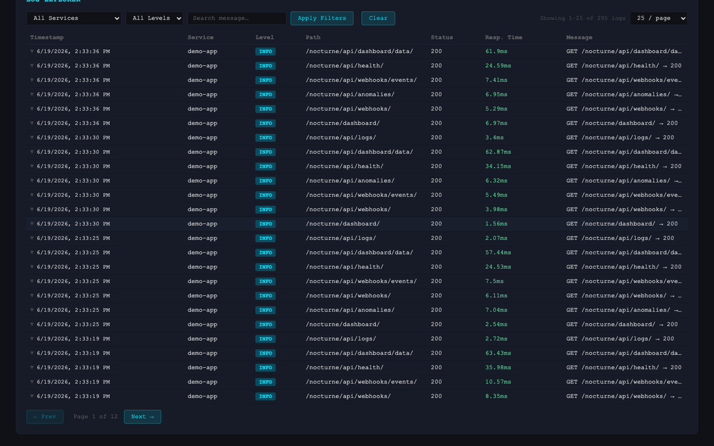
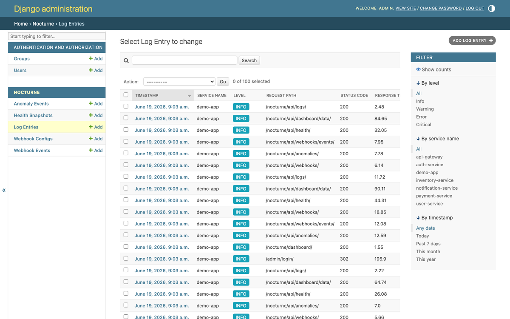
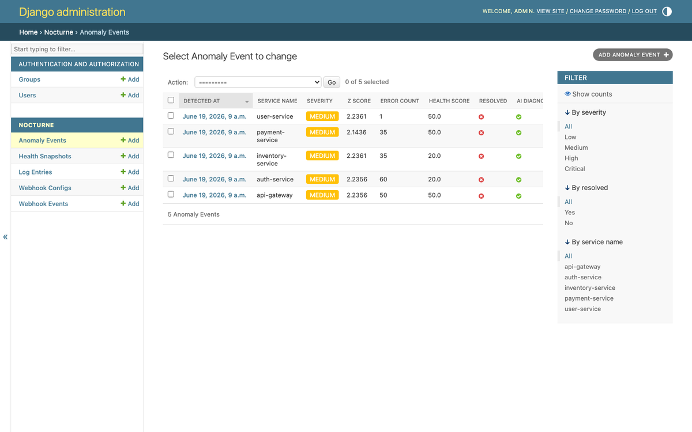
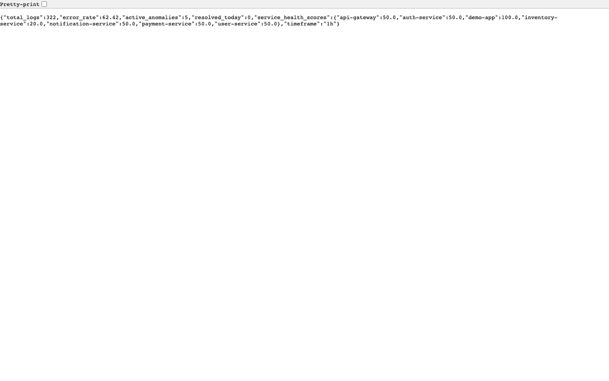

# django-nocturne

> Intelligent observability for Django. Detect anomalies, diagnose with AI, alert via webhooks — plug in, migrate, done.

[](https://pypi.org/project/django-nocturne/)
[](https://pypi.org/project/django-nocturne/)
[](https://pypi.org/project/django-nocturne/)
[](https://opensource.org/licenses/MIT)
[](https://github.com/rishav00a/django-nocturne/actions/workflows/ci.yml)
[](https://django-nocturne.readthedocs.io)
[](https://pypi.org/project/django-nocturne/)

---

## What is django-nocturne?

**django-nocturne** is a plug-and-play APM (Application Performance Monitoring) library for Django. It silently observes every HTTP request, statistically detects error spikes, asks an AI to diagnose them, fires webhook alerts, and renders a real-time dashboard — all with zero instrumentation changes to your application code.

### Features

- **Zero-code observability** — one middleware entry records every request automatically
- **Statistical anomaly detection** — Z-score analysis across 5-minute buckets; three severity tiers (MEDIUM / HIGH / CRITICAL)
- **Multi-signal health scoring** — composite 0–100 score from error rate, response time, and volume signals
- **AI-powered root-cause analysis** — LangChain interface supports Anthropic Claude, OpenAI GPT, Google Gemini, and local Ollama models
- **Webhook alerting** — HMAC-SHA256 signed payloads delivered to any HTTP endpoint when thresholds are breached
- **Health trend tracking** — per-service snapshots over time; dashboard shows improving/degrading/stable trends
- **Real-time dashboard** — Chart.js visualisations, log explorer with syntax-highlighted stacktraces, anomaly detail modals
- **Timeframe filter** — global 15M / 30M / 1H / 3H / 6H / 12H / 24H / 7D filter controlling all charts simultaneously
- **REST API** — full DRF API for health, logs, anomalies, webhooks, and dashboard data

---

## Screenshots

### Dashboard Overview

*Real-time system overview with total logs, error rate, and active anomalies*

### Error Rate & Service Health

*Error rate over time per service + health scores (0–100)*

### Anomaly Detection

*Detected anomalies with severity badges and Z-scores*

### Anomaly Detail with AI Diagnosis

*Z-score meter, plain English explanation, and LLM root cause analysis*

### Log Explorer

*Paginated log table with colored level badges and full-text search*

### Stacktrace Viewer

*Expanded log row showing exception badge, syntax-highlighted stacktrace, and AI analysis button*

### AI Root-Cause Analysis

*On-demand LLM diagnosis with root cause, fix, and prevention steps*

### Webhook Activity

*Live delivery feed showing status, payload, and response for every webhook event*

### Health Trends

*Per-service trend cards with ↑/↓/→ indicators and 0–100 composite scores*

### Timeframe Filter

*Global 15M–7D pill filter that updates all charts simultaneously*

### Django Admin — Log Entries

*Django admin list view for LogEntry with filtering and search*

### Django Admin — Anomaly Events

*Django admin list view for AnomalyEvent with severity and resolution status*

### REST API (DRF Browsable)

*DRF browsable API health endpoint response*

---

## Requirements

- Python 3.9+
- Django 4.2 or 5.1+
- Django REST Framework 3.14+
- numpy

---

## Quick Start

### 1. Install

```bash
# Core (no AI)
pip install django-nocturne

# With your preferred AI backend
pip install "django-nocturne[anthropic]"   # Claude
pip install "django-nocturne[openai]"      # GPT-4o
pip install "django-nocturne[ollama]"      # Local Llama via Ollama
pip install "django-nocturne[gemini]"      # Google Gemini
```

### 2. Configure (`settings.py`)

```python
INSTALLED_APPS = [
    # ... your apps ...
    "nocturne",
]

MIDDLEWARE = [
    # ... other middleware ...
    "nocturne.middleware.NocturneMiddleware",   # add last
]

NOCTURNE = {
    "SERVICE_NAME": "my-api",
    "ANOMALY_THRESHOLD": 2.0,              # Z-score cutoff
    "AI_BACKEND": "anthropic",             # 'anthropic' | 'openai' | 'ollama' | 'gemini'
    "AI_DIAGNOSIS_ENABLED": True,
    "ANTHROPIC_API_KEY": env("ANTHROPIC_API_KEY"),
    "ANTHROPIC_MODEL": "claude-sonnet-4-6",
}
```

### 3. Wire up URLs (`urls.py`)

```python
from django.urls import include, path

urlpatterns = [
    path("nocturne/", include("nocturne.urls")),
    # ...
]
```

### 4. Migrate and run

```bash
python manage.py migrate
python manage.py runserver
```

Open **http://localhost:8000/nocturne/dashboard/** — log in as a superuser.

---

## Configuration Reference

All settings live inside the `NOCTURNE` dict in `settings.py`.

| Key | Default | Description |
|-----|---------|-------------|
| `SERVICE_NAME` | `"default"` | Tag applied to all log entries by the middleware |
| `ANOMALY_THRESHOLD` | `2.0` | Z-score threshold to trigger anomaly detection |
| `RETENTION_DAYS` | `30` | Auto-purge log entries older than N days |
| `EXCLUDE_PATHS` | `["/health", "/static", "/favicon.ico"]` | Paths skipped by middleware |
| `LOGIN_URL` | `"/admin/login/"` | Redirect for unauthenticated dashboard access |
| `AI_BACKEND` | `"ollama"` | Active LLM backend: `anthropic` / `openai` / `ollama` / `gemini` |
| `AI_DIAGNOSIS_ENABLED` | `True` | Master toggle for all AI calls |
| `ANTHROPIC_API_KEY` | `""` | Claude API key |
| `ANTHROPIC_MODEL` | `"claude-sonnet-4-6"` | Claude model ID |
| `OLLAMA_BASE_URL` | `"http://localhost:11434"` | Ollama server URL |
| `OLLAMA_MODEL` | `"llama3.2"` | Ollama model name |
| `OPENAI_API_KEY` | `""` | OpenAI API key |
| `OPENAI_MODEL` | `"gpt-4o"` | OpenAI model ID |
| `OPENAI_BASE_URL` | `"https://api.openai.com/v1"` | Override for Azure / Groq / vLLM |
| `GEMINI_API_KEY` | `""` | Google Gemini API key |
| `GEMINI_MODEL` | `"gemini-1.5-flash"` | Gemini model ID |
| `WEBHOOK_SECRET` | `""` | HMAC-SHA256 secret for webhook signature validation |

---

## API Reference

All endpoints are prefixed with `/nocturne/` (or wherever you mounted the URLs).

| Method | Path | Auth | Description |
|--------|------|------|-------------|
| `GET` | `api/health/` | view | Health scores, error rate, anomaly counts |
| `GET` | `api/logs/` | view | Paginated log entries (no stacktrace) |
| `POST` | `api/logs/ingest/` | view | Ingest a log entry externally |
| `GET` | `api/logs/<id>/` | view | Full log entry including stacktrace |
| `POST` | `api/logs/<id>/analyse/` | view | AI root-cause analysis for a log |
| `GET` | `api/anomalies/` | view | List anomaly events |
| `PATCH` | `api/anomalies/<id>/` | admin | Resolve an anomaly |
| `POST` | `api/detect/` | admin | Trigger anomaly detection scan |
| `GET` | `api/dashboard/data/` | view | All chart data in one response |
| `GET` | `api/webhooks/` | admin | List webhook configurations |
| `POST` | `api/webhooks/` | admin | Create webhook configuration |
| `PUT` | `api/webhooks/<id>/` | admin | Update webhook configuration |
| `DELETE` | `api/webhooks/<id>/` | admin | Delete webhook configuration |
| `GET` | `api/webhooks/events/` | view | Webhook delivery history |
| `POST` | `api/webhooks/test/` | admin | Send test webhook to all active configs |
| `POST` | `api/webhook/receive/` | admin | Simulated receiver endpoint |
| `GET` | `dashboard/` | view | Browser dashboard (HTML) |

**Auth tiers:**
- `view` — superuser **or** user with `nocturne.view_nocturne` permission
- `admin` — superuser only

---

## Webhook Payload

When an anomaly is detected, Nocturne fires this payload to every active webhook config:

```json
{
  "event": "anomaly.detected",
  "timestamp": "2026-06-19T03:22:27Z",
  "watchdog_version": "0.1.0",
  "anomaly": {
    "id": 42,
    "service": "auth-service",
    "severity": "CRITICAL",
    "z_score": 4.7,
    "error_count": 50,
    "window_start": "...",
    "window_end": "...",
    "ai_diagnosis": "..."
  },
  "health": {
    "score_before": 85.0,
    "score_after": 20.0,
    "trend": "degrading"
  },
  "action_required": true,
  "dashboard_url": "/nocturne/dashboard/"
}
```

Headers sent:
- `Content-Type: application/json`
- `X-Watchdog-Event: anomaly.detected`
- `X-Watchdog-Severity: CRITICAL`
- `X-Watchdog-Signature: sha256=<hmac>` (when `WEBHOOK_SECRET` is set)

---

## Management Commands

Commands included with the package (available after `pip install django-nocturne`):

| Command | Description |
|---------|-------------|
| `nocturne_config` | Print resolved NOCTURNE settings + DB stats |
| `test_ai_diagnosis` | Verify AI backend is working |
| `create_nocturne_user` | Create a viewer user with correct permissions |
| `snapshot_health` | Take a health snapshot for all active services |

```bash
python manage.py nocturne_config
python manage.py test_ai_diagnosis
python manage.py test_ai_diagnosis --backend openai
python manage.py create_nocturne_user
python manage.py create_nocturne_user --username viewer1 --password secret
python manage.py snapshot_health
```

Commands available in the example project only:

| Command | Description |
|---------|-------------|
| `generate_demo_logs` | Seed 975 demo logs with 3 anomaly spikes, WebhookEvents, and HealthSnapshots |

```bash
python manage.py generate_demo_logs
```

---

## Running the Example Project

```bash
git clone https://github.com/rishav00a/django-nocturne
cd django-nocturne
python -m venv .venv && source .venv/bin/activate
pip install -e ".[anthropic]"   # or [ollama], [openai], [gemini]
cd example_project
python manage.py migrate
python manage.py createsuperuser
python manage.py generate_demo_logs
python manage.py runserver
```

Visit **http://localhost:8000/nocturne/dashboard/** and log in.

---

## Running Tests

```bash
pip install -e ".[dev]"
pytest tests/ -v
```

---

## Contributing

See [CONTRIBUTING.md](CONTRIBUTING.md).

---

## Changelog

See [CHANGELOG.md](CHANGELOG.md).

---

## License

MIT — see [LICENSE](LICENSE).
